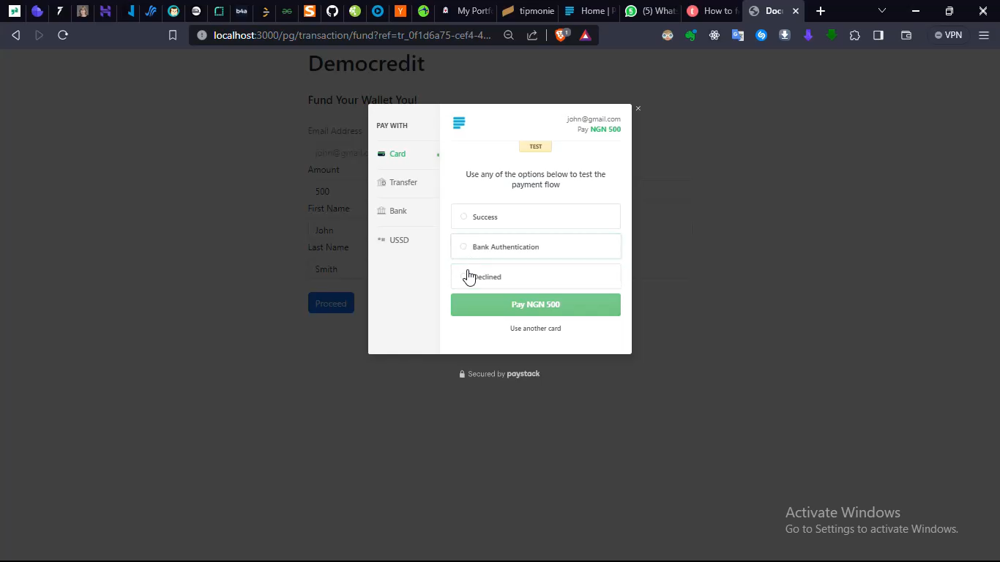
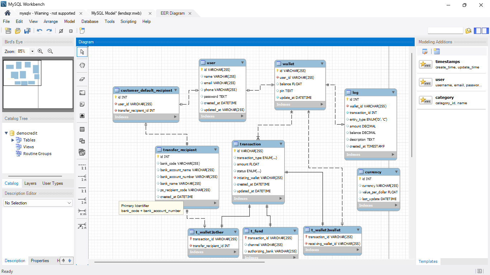
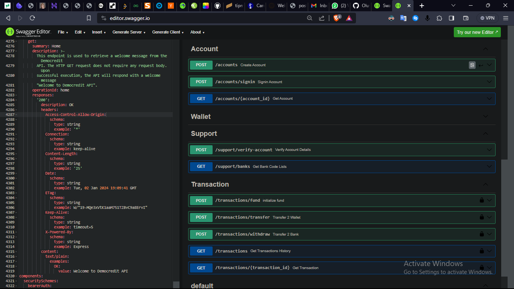
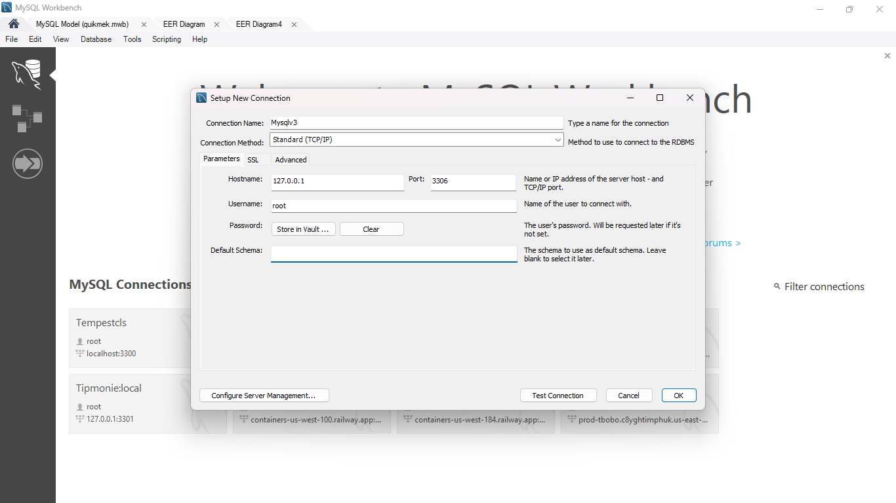
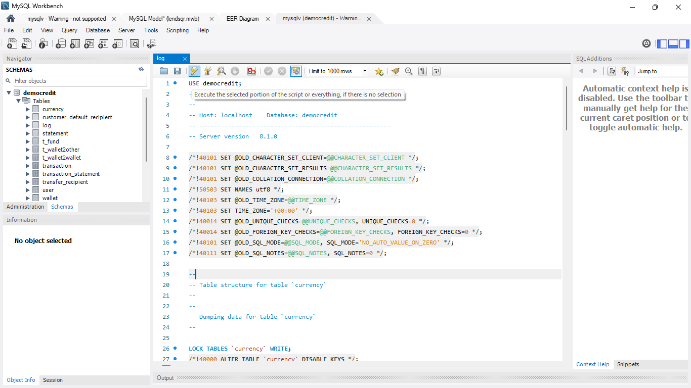
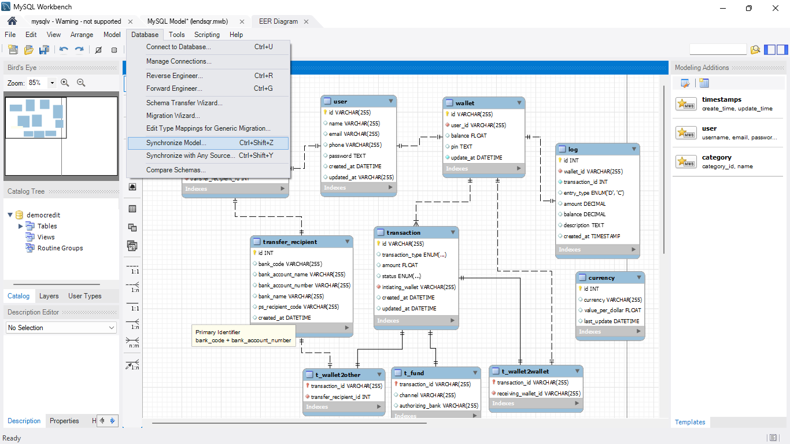
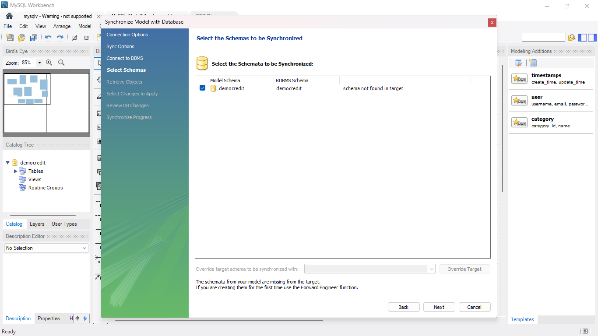
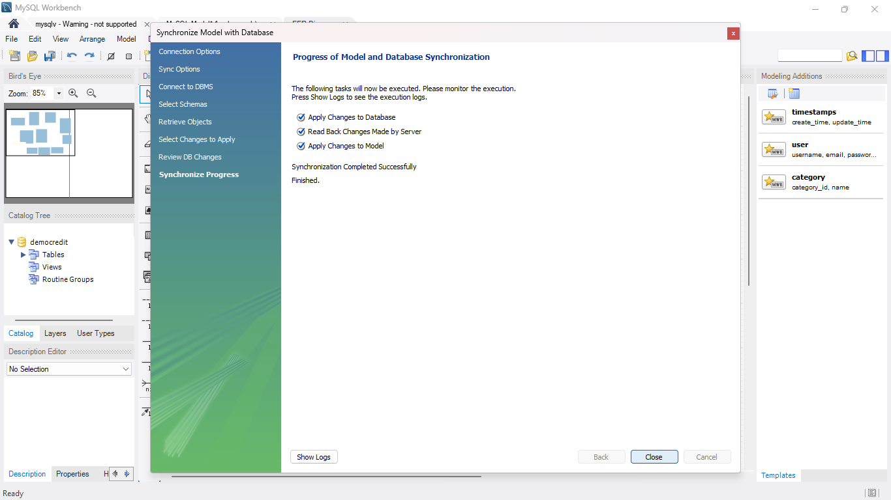
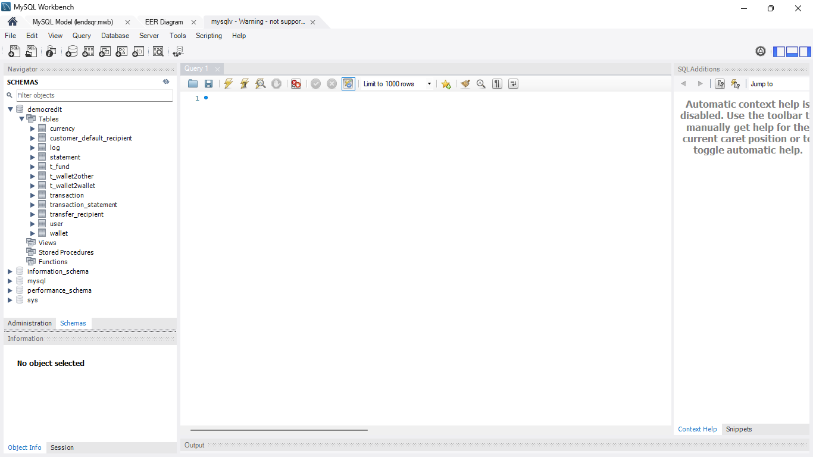
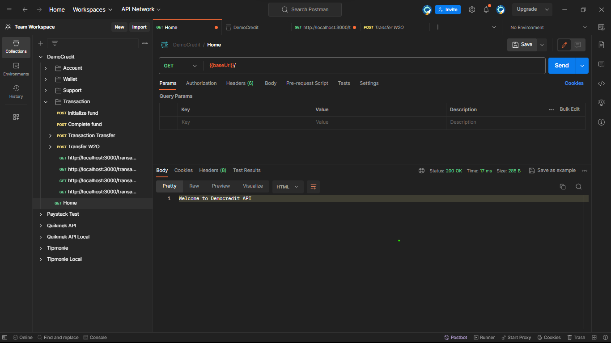

<!-- @format -->

# Democredit

An eWallet system Integrated with Paystack Payment Service





This project incorporates my API development skills, practices, and methodology that I've established over the years into a beginner-friendly project that may be beneficial to other developers

### Stack

- Node Js (Express)
- Mysql(Sequelize)
- Docker
- Paystack

### Features

- User Authentication with bearer token (slightly faux)
- Create and Get Wallet
- Transaction Fund
- Transaction Wallet to Wallet
- Transaction Wallet to Bank
- Paystack Integration
- Bank Account Details verification
- Bank Code List
- OOP with Typescript
- Unit Tests

### Coming Soon

- Pin protection
- Transaction charges

### Conventions

The style and architecture of this project are explained on the [conventions](./convention.md) page

<br/>

## Get Started

- [DemoCredit](#democredit)
- [Stack](#democredit)
- [Features](#democredit)
- [Coming Soon](#democredit)
- [Conventions](#conventions)
- [Running the Project](#running-the-project)
- [Environmental Setup](#set-up-environmental-variables)
- [Database Setup](#set-up-database)
- [Install Dependencies](#install-npm-dependencies)
- [Run Project](#run-project)
- [Test With Postman](#test-project)

<br/>

## Running the Project

### Set up environmental variables

- Rename `.env.example` file to `.env` in the root directory and set your actual values

- Head down to <a href="https://dashboard.paystack.com/#/login">Paystack Developer</a>, create an account, obtain your secret and public key and fill them in

- `HOME_URL` should point to your host's base url or localhost:<port> if on development. This is important

```
NODE_ENV=development
PORT=3000
HOST=
HOME_URL=
MYSQL_HOST=
MYSQL_PORT=
MYSQL_USER=
MYSQL_PASSWORD=
MYSQL_DATABASE=
PAYSTACK_SECRET_KEY=
PAYSTACK_PUBLIC_KEY=
```

### Set up database

This tutorial assumes you have at least basic background knowledge on MySQL and MySQL Workbench

<b>Connect to MySQL server</b>

- Get your mysql server ready
- Install mysql workbench
- Connect workbench to your server
  

<b>Migrate DB Data</b>

There are two options You can either choose to migrate only the database structure or migrate both structure and sample data

<b>Migrate Structure and Data</b>

- Open up a new query tab on your workbench
- Copy the content of `mysql/db_dump.sql`
- Paste and run the query
  

<br/>

<b>Migrate Structure only</b>

- Open the `mysql/democredit.mwb` file via MySQL Workbench
- Go to `Database` on the nav bar and select `Synchronize Model`

  

- Choose the server connection you wish to synchronize to
- Select Democredit and click next

  

- Click next all through and wait till the change is complete. You should get a screen like this.

  

- Click done, open your coonection on workbench and the changes should reflect. If not refresh the connection

  

### Install npm dependencies

- Run `npm install`

### Run Project

run `npm run dev` to run on development mode. This is not a real project so production mode is not provided

### Test Project

Open postman and send a get request to `localhost:3000` or provided port on your .env. You should get `Welcome to Democredi API` if everything is OK.


